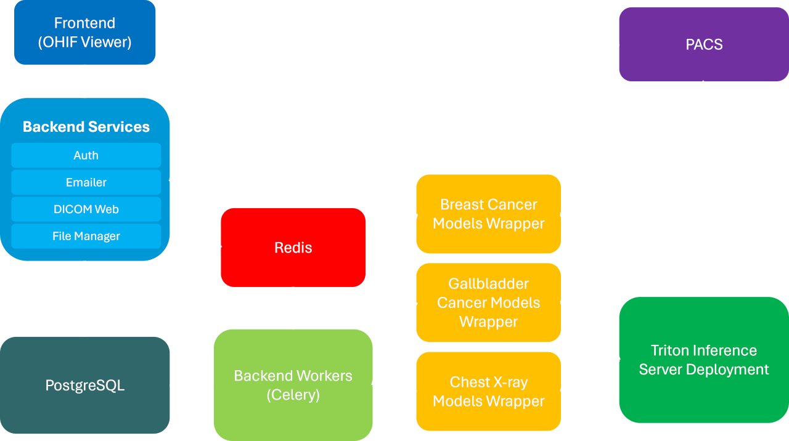

# Work Experience

  ## Vision Lab, IIT Delhi - Project Scientist

Apr 2023 – Present

### CoE AI in Healthcare

Developed the IIT Delhi [CoE AI in Healthcare](https://www.thehindu.com/news/national/centre-sets-up-ai-hubs-for-research-on-health-agriculture-sustainable-cities/article68757384.ece) system for Breast Cancer Detection, Gall Bladder
Cancer Detection, and Chest X-Ray classification.

IIT Delhi and AIIMS Delhi have been selected as the Centre of Excellence for AI in Healthcare by
the Ministry of Education, Government of India. Our team has received a grant of ₹ 300 crores (~
35.5 million USD).

Our systems that have been installed and tested in AIIMS Delhi, NCI-AIIMS Jhajjar, and PGIMER
Chandigarh have helped in the diagnosis of over 1,200 patients. One of the dashboards is
shown below:

We also have an online deployment in which data is protected by authentication. This also
facilitates the sharing of data among different hospitals (with the due permission of the owner)
and includes role-based access control.

Myself and my team have worked on the end-to-end development and deployment of the
system, including gathering user feedback and making enhancements to the system
accordingly. Some of my key work includes (but is not limited to):-

- Constructing Authentication, DICOM Web, and secure data sharing services using
  Django Rest Framework and PostgreSQL.
- Utilizing Celery with Redis for task queue management and integrated live status
  updates for inference processes to enhance user experience.

- Organizing the containerization and deployment the applications on the IIT Delhi Cloud
- Deploying PyTorch and TensorRT models using Nvidia's Triton Inference Server. The
  models are deployed as Microservices that can be scaled independently.
- Building and deploying an LRU-cache-based Wrapper for the Triton Inference Server,
  leading to a 97% reduction in the inference API's response time.
- Developing and executing SQL migration scripts to make updates to database schemas
  while maintaining data integrity.
- Setting up Cron jobs for database backups and for removing unreferenced files from
  Storage.
- Orchestrating on-premise (internet-isolated) deployments of the applications in AIIMS
  Delhi, NCI-AIIMS Jhajjar, and PGIMER Chandigarh.

The team in AIIMS Delhi:

### Interactive Machine Learning

Semantic Segmentation of Medical Images and Volumes is often done by radiologists
as part of a patient’s treatment process.

For example, here’s a segmentation of a liver tumor:

Doing segmentation manually is a tedious task. ML Models can be leveraged for the
process but they require immense training data. In case where this training data is not
available, there is no other option but to perform manual segmentation. This is where
Interactive Machine Learning (IML) comes in handy.

IML leverages a small model that is trained with a few samples of data. When this model
is told to segment an object (or organ), it gives a poor segmentation initially. The user
can then correct the segmentation (by means of providing scribbles) and the IML
framework allows the model to learn the corrected segmentation. The next time a
similar object is segmented, the model performs a little better. Over time, the model
learns to segment the object as well as a foundational model.

It can be observed that the shape and size of an organ do not differ much across two
consecutive frames of the volume. The GIF below demonstrates this.

So, once the radiologist has corrected a mask for a particular frame, it is possible for us
to use Video Object Segmentation techniques to track the mask through the rest of the
volume. However, if the mask is tracked incorrectly on a particular frame, the user can
correct this segmentation by providing scribbles.

A small demo of the system with tracking integrated can be found [here](https://www.youtube.com/watch?v=BbaQqNDbHWc).

#### Publications

No Prompting Frozen Foundation Models: Interactive Medical Volume
Segmentation using Continual Test Time Adaptation of Compact Models - ACM
ICVGIP 2024
--- Kushal Borkar, Abhilaksh Singh Reen, Amit Kumar Garg, CV Jawahar, Chetan
Arora

My work in the project has mainly focused on:

- Finetuning the UNet++ model to perform single-label and multi-label semantic
  segmentation of organs on CT and MRI scans.
- Constructing the API for the interactive pipeline that allows scribbles to be sent to a
  model for test-time training. The API is generic and can be easily integrated with a tool
  like 3D Slicer or the OHIF Viewer.
- Building an extension for 3D Slicer that allows interactive segmentation of any loaded
  volume.

- Integrating with the AoT Video Object Segmentation model to track a segmentation
  corrected on one Frame of the volume on all the following frames

- Experimenting with techniques such as CascadePSP to refine segmentation masks.
- Deploying the pipeline (IML + VOS + Refinement) and the OHIF-Viewer based frontend
  on a cloud server as well as on an Nvidia Jetson AGX Device.

### Lipikar – OCR for Indic Languages

Digitization of documents is important not only for their preservation but also for
enchancements such as Search Engine Optimization. OCR is essential in this process.
But, no OCR model is a 100% perfect and often requires human correction.

Lipikar is a tool that enables ML models to do 99% of this work and allows a user to
perform the remaining 1%.

The typical OCR workflow would be as follows:

1. The image of a page is given to a Detection Model that outputs bounding boxes
   corresponding to each word or each line (as per the configuration). The bounding
   boxes are used to generate crops of the words/lines.
2. These crops are passed to a Recognition Model which outputs a text string
   corresponding to each crop.
3. Using the locations of the bounding boxes and text strings corresponding to each
   of them, the text for the entire page is reconstructed.

By default, all the three stages are executed in an automated manner. After the ouput is
produced, Lipikar allows the user to change the output of a particular stage and execute
the remaining stages after it, allowing maximum efficiency in the annotation process.

For example, if a bounding box has been predicted incorrectly, it can be corrected by the
user and stages 2 and 3 executed. “Re-Running OCR for a single bbox”.

Or, if the text corresponding to a bbox has been predicted incorrectly, the user may
correct it manually.

And, finally, if the texts are not in the right order, the user has the ability to move them
left or right in a given line, to the next or previous line, or move the entire line up or down.

[This](https://www.youtube.com/watch?v=GG66x0s0oy0) is a small demonstration of the system.

My work in the project has included:

- Building an Authentication service for the application, including email
  verification on signup and password reset via email.
- Working on Inter-Process Communication using REST APIs, abstracting the ML
  inference into separate processes.
- Constructing the infrastructure for live status updates of on-going inference
  tasks back to the frontend.
- Creating reliable distributed storage using Gluster FS to manage hundreds of
  thousands of images.
- Collaborating with the DevOps team to deploy the applications in a
  containerized manner on the IIT Delhi Cloud.
- Setting up Monitoring (Metrics and Log Collection) using Grafana, Prometheus,
  Loki, and Promtail. Configuring the Prometheus Alert Manager to send email and
  Telegram alerts via a Webhook.

At the moment, Lipikar is being Proudly used by Rekhta.org and Tata 1mg.

The Lipikar Team:

## Uipro Corporation - Full-Stack Developer Intern

July 2021 – Jan 2022

- Worked on the Backend and Admin Interface of an E-commerce system, powered by
  Node, Express, and PostgreSQL. Created APIs for user authentication via OTP,
  processing payments, and adding stock to the store, including upload of product images
  to AWS S3.
- Utilized Redis for adding a server-side caching layer, reducing the API's average
  response time from 252ms to 89ms.
- Added real-time location tracking for the Delivery Person's application to monitor the
  distance travelled along with the vehicle's location in case of a mishap.
- Built a Razorpay Payment Verification Webhook to verify payments from the Razorpay
  Payment Gateway.

# Education

## Guru Gobind Singh Indraprastha University

July 2019 - July 2023

Bachelor's in Computer Science Engineering | GPA: 8.94

# Hackathons and Projects

## Abnormal Docs - CT Reports

Pragati Hackathon 2023

It is often the case that the radiology report of a CT or MRI scan includes medical jargon that is
beyond the understanding of a layman. With the recent advancements, we can leverage LLMs to
parse such a report and provide a simplified version. Anyone with a smartphone would be able
to view this simplified report on a secure link (or QR code) provided to them along with their
radiology report.

On top of that, if an animation is displayed that highlights the area of the ailment, it would
significantly enhance the patient's understanding of the problem.

Building the animation is completely automated and is a four-step process:

1. A segmentation model segments the CT/MRI volume into different organs, bones,
   muscles, etc.
2. A voxel data to mesh algorithm converts the segmentation into a 3D model.
3. Using inter-LLM agreement on the radiology report, we identify the exact part of the body
   that has been affected.
4. An animation is generated procedurally that highlights the said body part, text on screen
   and a corresponding TTS voiceover elaborates the problem.

### The Problems

We observed that the segmentation model would often incorrectly segment any abnormalities.
For example, it would not recognize a fracture in the bone and give the segmentation of a normal
bone instead. This is primarily because the segmentation model has never seen a broken bone
in its training.

Even state-of-the-art LLMs like GPT-4 would fail to translate medical jargon into layman
language. The application demands a negligible error rate. For example, with an accuracy of
98%, 2 out of every 100 patients are getting an incorrect simplified report (that they may be
paying additional charges for).

While inter-LLM agreement can be used to identify the region of the abnormality in the body, it is
far more difficult to do so for the entire simplified report. A region of the body is an enumerated
type, LLMs can be prompted to output these enumerated types only and then their outputs can
be majority voted. However, this cannot (at least not currently) be done with more verbose
outputs, such as an entire page describing a radiology report.

Our process of generating the simplified report along with the animation is compute heavy. It
requires running a 3D segmentation model, multiple LLMs (for inter-LLM agreement), and
intensive algorithms to convert the segmentation on a mesh and then optimize its size. A
machine in the cloud that can perform these tasks could easily cost $25 per hour to run.

My work in this project has included:

- Building the pipeline to generate the 3D model from a patient’s medical volume. The
  pipeline is accessible via an API.
- Generating procedural animations in Three.js based on the Region of Interest in the
  model and its geometry.
- Designing, constructing, and deploying the backend server that allows addition of new
  reports.
- Querying the GPT-4 API to simplify reports.
- Querying multiple LLMs (GPT-4, LLaMA 2, Falcon 40b) to identify the region of interest.
- Creating a unique secure link (QR Code) on the backend using which the generated
  animation and the simplified report can be accessed.
- Powered By: Django Rest Framework, Huey, PostgreSQL, Redis, React, Three.js.

Myself and my colleague Dr. Amit Kumar Garg at IIT Jodhpur:

## Platformatic – [Contributor](https://github.com/platformatic/platformatic/commits?author=AbhilakshSinghReen)

**Platformatic is a node package that gets over 700,000 downloads per week.**

- Allowed the configuration of serving backend metrics on the application server or on a
  separate dedicated port.
- Created the algorithm for adding summaries and descriptions of dynamically generated
  routes to the Open API specification.
- Added error handling to prevent the Platformatic CLI process from crashing in case it
  fails to fetch configuration from a particular URL.

# Skills

## Languages

Python, JavaScript, TypeScript, C, C++

## Libraries and Frameworks

Django, Django Rest Framework, Fast API, Node.js, Next.js, Express.js, Fastify, GraphQL, React,
Redux, Three.js, PyTorch, OpenCV, NumPy

## Databases

PostgreSQL, MySQL, MongoDB, Cloud Firestore, Redis

## Infrastructure

Docker, Docker Compose, Nginx, GlusterFS, Rabbit MQ, Celery, TensorRT, Triton Inference
Server, Cloud Functions, AWS (EC2, Lambda, S3), Firebase

## Monitoring

Grafana, Prometheus, Grafana Loki

## Other

Git, GitHub, GitHub Actions, Boto3, Grafana k6

# Achievements

### Pragati Hackathon 2023

Final Stage

### Veersa Hackathon 2022

Semi-Finals

### [CodeForces](https://codeforces.com/profile/AbhilakshSinghReen)

- Specialist (1,484)
- Top 12.5 %

### [LeetCode] (https://leetcode.com/u/AbhilakshSinghReen/)

- Contest Rating 1,837
- Top 6.25 %

